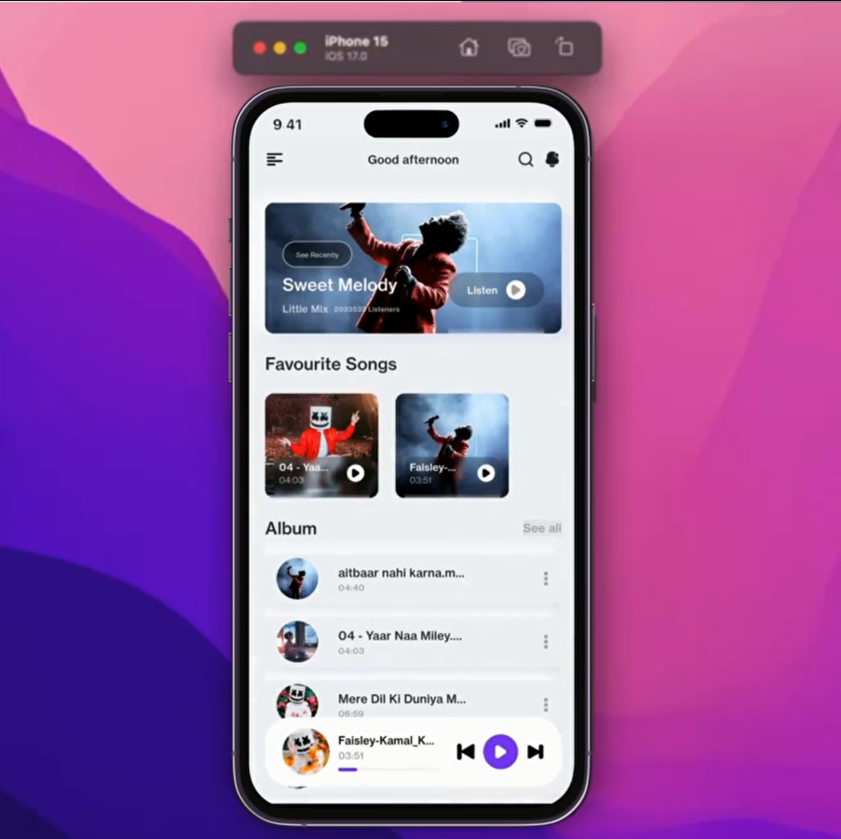
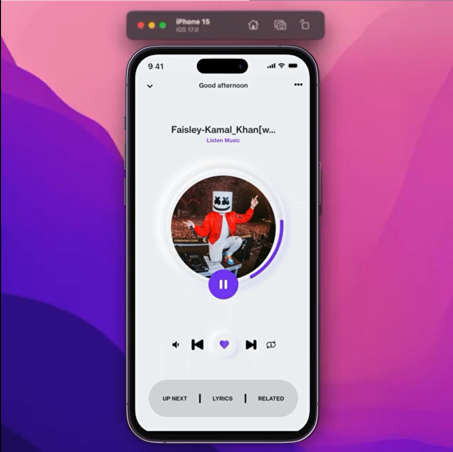

# Flutter Harmony Player

Flutter Harmony Player is a sleek and modern music streaming application that allows users to enjoy their favorite audio files from local storage. With its elegant neumorphic design and smooth functionality, it offers an immersive music experience.

## Screenshots

Take a look at the app's interface:

**Dive into your music world with Flutter Harmony Player!**

**Features:**

* **Easy navigation:** Browse your music library effortlessly.
* **Elegant design:** Enjoy a visually appealing neumorphic UI.
* **Smooth playback:** Experience seamless audio control and playback.
* **Custom playlists:** Organize your favorites and create personalized playlists.
* **Responsive performance:** Powered by BLoC for a fluid user experience.

**Key Technologies:**

* **Flutter:** Build cross-platform apps with ease.
* **BLoC:** Manage state efficiently for a reactive app.
* **Neumorphic design:** A modern and stylish user interface.
* **Just Audio:** A robust audio playback engine.

**Get Started:**

1. **Clone the repository:** `git clone repo-link`
2. **Install dependencies:** `flutter pub get`
3. **Connect your device or start an emulator.**
4. **Run the app:** `flutter run`

### Dependencies

This project uses the following dependencies:

* shared_preferences: For storing user preferences.
* bloc: Core BLoC library for state management.
* flutter_bloc: BLoC integration with Flutter widgets.
* equatable: Simplifies object comparison for BLoC.
* google_fonts: Access a wide variety of fonts for customization.
* flutter_svg: Display and interact with SVG icons and images.
* sqflite: SQLite database for persistent data storage.
* path_provider: Provides access to device file system paths.
* path: Utilities for handling file and directory paths.
* permission_handler: Requests and manages runtime permissions.
* just_audio: Powerful audio player for Flutter applications.
* on_audio_query: Fetches and organizes audio files from device storage.
* layout_pro: Advanced layout capabilities for complex UI structures.
* shimmer_effect: Create shimmering loading animations for a polished look.

**Spread the Music:**

* **Star the project on GitHub if you like it!**
* **Share with your friends and music enthusiasts.**

**Let the harmony flow!**

# Harmony-Player
